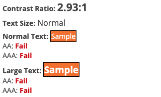

<figure>

 

</figure>

#### Problema

Se evidencian contrastes de hasta 2.93:1

#### Solución

Aumentar contraste entre elementos a un mínino de 4.5:1

#### Leer más

- [Comprendiendo el criterio de exito 1.4.3: Contraste (Mínimo)](https://www.w3.org/WAI/WCAG21/Understanding/contrast-minimum.html)