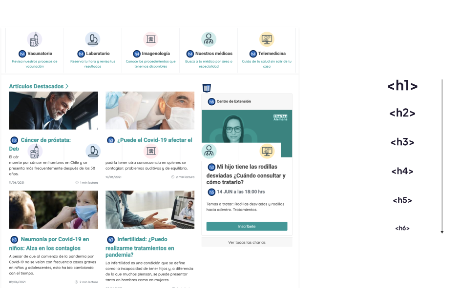

<figure>

 

</figure>

#### Problema

La página lo posee una estructura jerárquica de contenidos clara, lo cual dificulta su navegación a través de tecnologías asistidas.

#### Solución

Es necesario organizar el texto de forma jerárquica, de manera de que cada item sea catalogado como “titulo” o “subtitulo” mediante headings en el HTML y estén contenidos dentro de un elemento mayor.

#### Leer más

- [Comprendiendo el criterio de exito 1.3.2: Secuencia significativa](https://www.w3.org/WAI/WCAG21/Understanding/info-and-relationships.html)