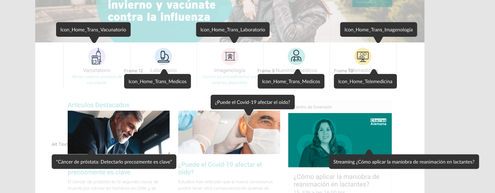

<figure>

 

</figure>

#### Problema

Se evidencia el uso de textos alternativos en las imágenes presentes en el sitio, no obstante, contienen información incompleta o irrelevante para el usuario. Esto puede causar confusión en usuarios y entorpecer el flujo de los mismos.

#### Solución

Remover el textos alternativos en imagen con propósito decorativo y ampliar explicación de contenido en imágenes con propósito informativo.

#### Leer más

- [Comprendiendo el criterio de exito 1.1.1: Contenido no-textual](https://www.w3.org/WAI/WCAG21/Understanding/non-text-content.html)